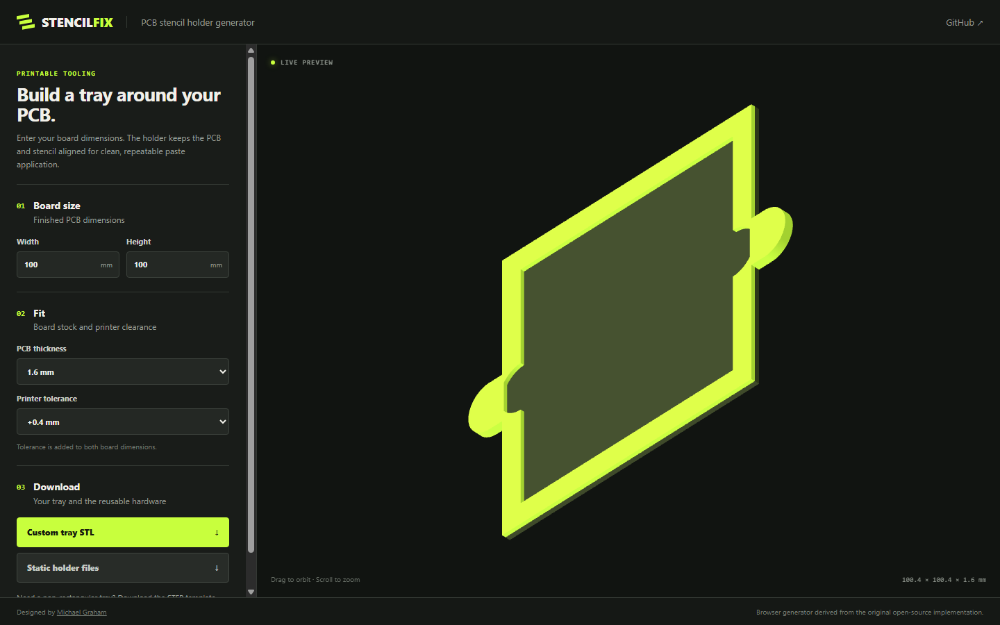
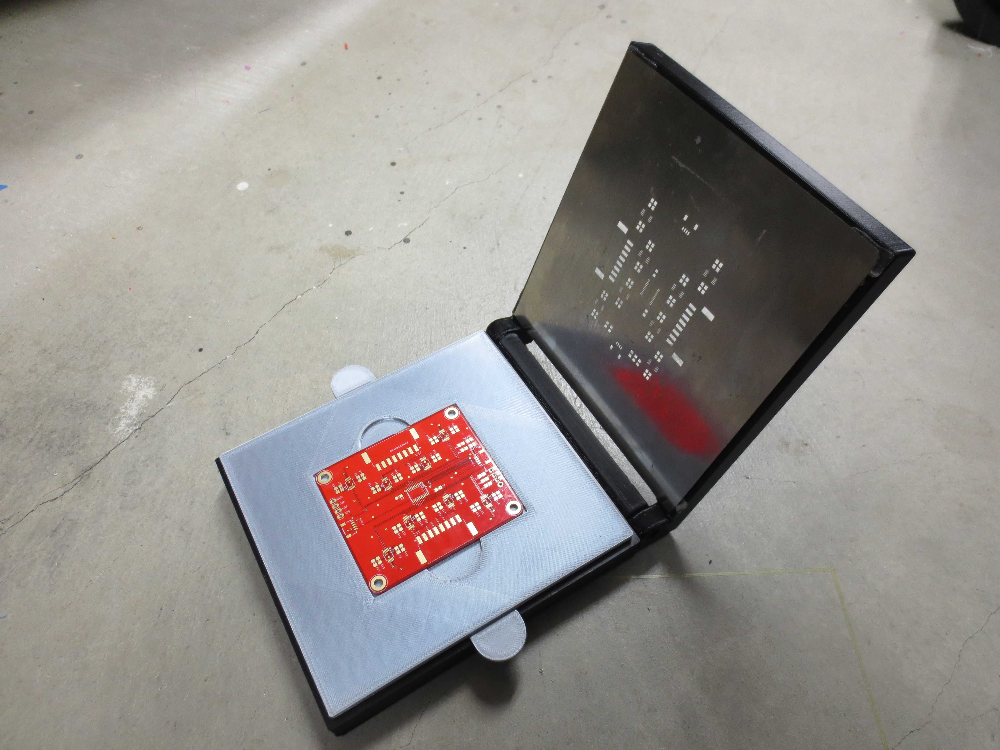

# PCB Stencil Holder Generator

A browser-based generator for making a custom 3D-printable PCB tray. The tray works with the included stencil-holder hardware to keep a board and solder stencil aligned during paste application.

**Live tool:** <https://mechengineermike.github.io/SolderStencilPCBHolder/>

## Use it

1. Choose the 99 mm, 150 mm, or 201 mm holder assembly.
2. Enter the finished width, height, and thickness of the PCB.
3. Select a clearance value that suits your printer.
4. Download the generated tray STL and matching static holder bundle.

The model is generated entirely in the browser; no files or dimensions are uploaded. The three holder bundles support board widths up to 99 mm, 150 mm, or 201 mm. Board height can extend to the full 118 mm, 169 mm, or 220 mm tray body, consuming the top and bottom margin as needed. Each bundle includes STL and STEP files plus a blank tray for non-rectangular designs.

## Credits

- Original holder design: [Michael Graham / mechengineermike](https://github.com/mechengineermike)
- Initial browser generator: Curly Tale Games LLC
- Current interface and maintenance: Michael Graham

## License

Released under the [MIT License](LICENSE).

## What it makes

The generator creates the PCB-sized center tray used with the printable hinge, frame, and feet from the original [Solder Stencil PCB Jig project on Thingiverse](https://www.thingiverse.com/thing:6313798).

| Original printed jig | Browser tray generator |
| --- | --- |
|  |  |

*Original project photo by Michael Graham, from [Thingiverse thing:6313798](https://www.thingiverse.com/thing:6313798).*
